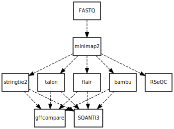

# MAC pipeline : Mapping, Analysis, Comparison

## Installation

### Dependencies

- Snakemake (needs to be installed through conda)
- (All other tools are installed and maintained by Snakemake)

### Installation process

Clone the git repo via `git clone git@gitlab.com:bioinfog/macfab.git` (or `git clone https://gitlab.com/bioinfog/macfab.git`).

## How to use

1. Edit the `config.yaml` file to set paths to datasets (fastq file, reference annotation and sequence) and metadata.

2. Enter in the new repo and simply execute the file `launch.sh` to run the pipeline on SLURM. You can also do this manually by loading snakemake and issue the command:

```
. /local/env/envsnakemake-5.20.1.sh

snakemake --use-conda \
    --cores <int> \
    -j <int> \
    --rerun-incomplete \
    --conda-frontend mamba \
    --cluster "sbatch --cpus-per-task={threads} --mem={resources.ram} --output=slurm_{rule}-%j.out --job-name={rule}" \
    --latency-wait 60 \
    --keep-going \
    --restart-times 3
```

## Outputs

At the end of the pipeline, all your results will be located in the `results` subfolder. You will find :

- The alignement bam and bai files from minimap2.
- 4 gtf from stringtie2, bambu, flair, and talon.
- 4 gtf filtered (keep only exons seens in the alignement bam) and corrected (all transcripts that have a strand="." are deleted, it's often the case for bambu and stringtie)
- A coverage analysis by RSeQC
- Some GTF analysis by SQANTI3 and GFFCompare

## Informations

- The "cores" option set the max threads available to the rules.
- Your gtf, fa and fatsq (reported in `config.yaml`) can be gzipped or not.
- You can add other parameters in the command line ([description here](https://snakemake.readthedocs.io/en/stable/executing/cli.html)). Here, the optionnal parameters used are :
  - `--conda-frontend mamba` to install all conda dependencies faster.
  - `--rerun-incomplete` to rerun all incomplete rules (if an error occurs)
  - `--latency-wait 60` to wait 60sec because the use of slurm create sometimes some filesystem latency and snakemake catch an error.
  - `--keep-going` to continue the execution of the pipeline even if an error occurs.
- You visualize via a [DAG](https://en.wikipedia.org/wiki/Directed_acyclic_graph) using `snakemake --dag -n ` and then [dedicated website](https://dreampuf.github.io/GraphvizOnline) to visualize it.


